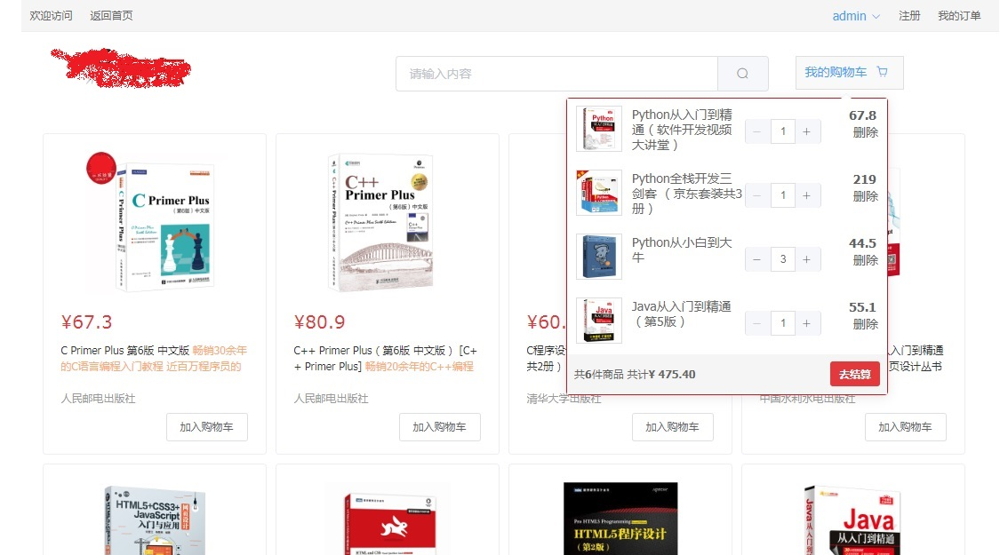

##项目简介
这是一个简单模仿京东商品页面的小项目，项目采用SpringBoot+Vue+ElementUI前后端分离方式开发。

配套前端：[https://github.com/allen512/vue-book-client](https://github.com/allen512/vue-book-client)

项目部署后访问地址：localhost:8088  
登录账户：admin   
密码：Aa1234

## 后端技术栈

1.SpringBoot  
2.SpringSecurity   
3.spring data jpa  
4.MySQL  
5.redis

## 前端技术栈

1.Vue  
2.ElementUI  
3.axios  
4.vue-router   
5.vuex

## 项目截图

